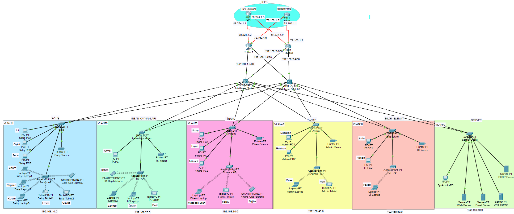

# 🏢 TradingCompanyNetwork

Cisco Packet Tracer ile oluşturulmuş kurumsal bir **ticaret şirketi ağı** simülasyonu. Bu proje; satış, insan kaynakları, finans, bilgi işlem ve yönetim gibi departmanlara ayrılmış VLAN yapısı, IP adresleme, yönlendirme, DHCP ve DNS ayarlarını içeren temel bir ağ altyapısı sunar.

## 📌 Proje Özeti

Bu ağ tasarımı, orta ölçekli bir şirketin temel IT altyapısını simüle etmeyi amaçlar. Simülasyon Cisco Packet Tracer üzerinde çalışacak şekilde hazırlanmıştır.

## 🖼️ Ağ Topolojisi

### Uygulanan Bileşenler:

- ✅ **VLAN Konfigürasyonu**: Departmanlara göre ağ segmentasyonu  
- ✅ **Statik Yönlendirme**: Router’lar arasında IP trafiği  
- ✅ **DHCP Sunucusu**: Otomatik IP dağıtımı  
- ✅ **DNS Sunucusu**: Alan adı çözümlemesi  
- ❌ **VoIP (IP Telefonlar)**: **Henüz entegre edilmedi**  
- ❌ **Firewall (ASA)**: **Henüz entegre edilmedi**

## 🖥️ Gereksinimler

- [Cisco Packet Tracer](https://www.netacad.com/courses/packet-tracer) (Sürüm 8 veya üzeri önerilir)

## 🗂️ Dosya Yapısı

📁 TradingCompanyNetwork/
│
├── 📄 TradingCompanyNetwork.pkt # Ağ simülasyonu (Cisco Packet Tracer dosyası)
├── 📄 README.md # Proje açıklaması

## 🧭 IP Planı & VLAN Dağılımı

| Departman        | VLAN ID | IP Bloğu         | Örnek IP        |
|------------------|---------|------------------|-----------------|
| Satış            | 10      | 192.168.10.0/24  | 192.168.10.10   |
| İnsan Kaynakları | 20      | 192.168.20.0/24  | 192.168.20.10   |
| Finans           | 30      | 192.168.30.0/24  | 192.168.30.10   |
| Bilgi İşlem      | 40      | 192.168.40.0/24  | 192.168.40.10   |
| Yönetim          | 50      | 192.168.50.0/24  | 192.168.50.10   |
| ISP (Ana Hat)    | -       | 88.224.1.0/30    | 88.224.1.1      |
| ISP (Yedek Hat)    | -       | 78.160.1.0/30    | 78.160.1.1      |

## 🚀 Başlangıç

### Gerekli Araçlar:
- [Cisco Packet Tracer](https://www.netacad.com/courses/packet-tracer) (≥ v8.x)

### Simülasyonu Çalıştırmak için:
1. `TradingNetwork.pkt` dosyasını Cisco Packet Tracer ile açın.
2. Cihazlara tıklayarak CLI veya GUI üzerinden yapılandırmaları inceleyin.

## 🔧 Özelleştirme

- Yeni departmanlar ekleyebilir
- OSPF/EIGRP gibi dinamik routing yapılandırabilirsiniz
- Syslog, NetFlow veya SNMP ile izleme sistemleri dahil edebilirsiniz

## 📬 İletişim

📧 **Dogukan Yılmaz** – [dogukanylmz137@hotmail.com](mailto:dogukanylmz137@hotmail.com)

Proje ile ilgili öneri, katkı ya da hata bildirimleriniz için çekinmeden iletişime geçebilirsiniz.

---

> Bu proje Cisco Networking Academy eğitimi kapsamında eğitim ve simülasyon amaçlı hazırlanmıştır.
